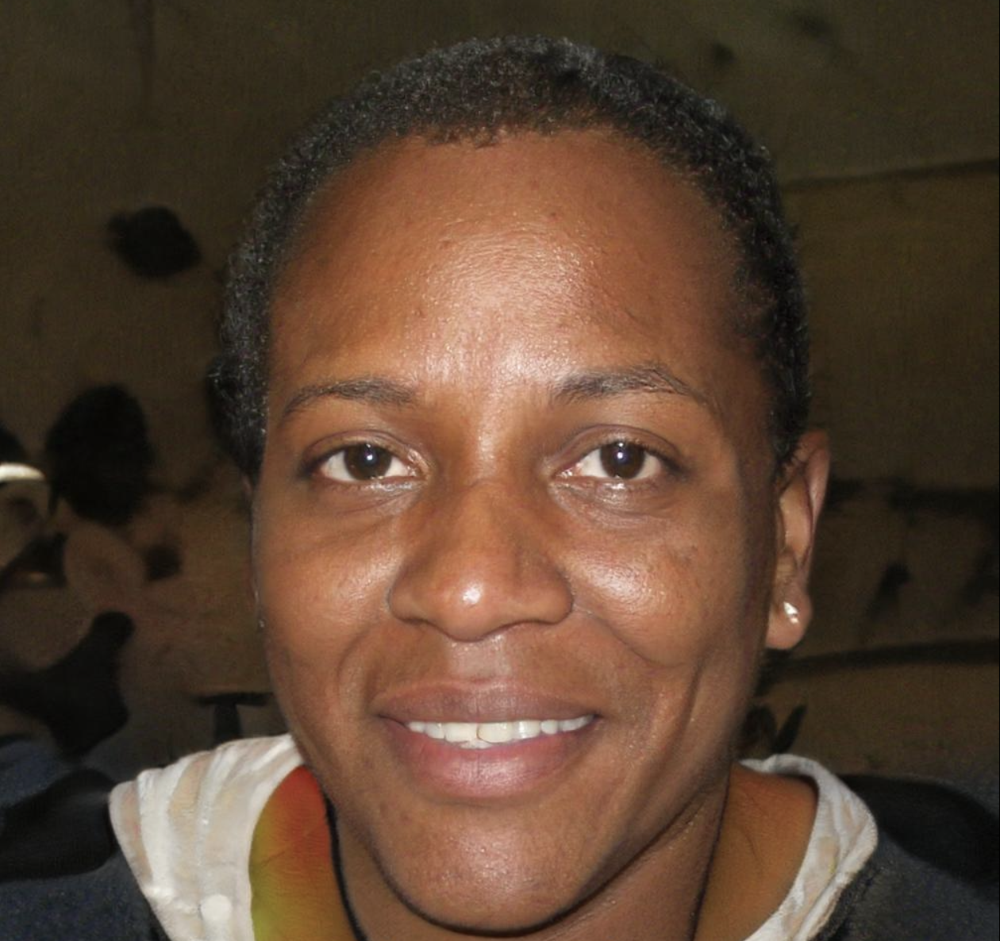

## Personagem: O animado

## Nome: Antônio Pires

## Foto: 

## Citação:

> "Sair de que jeito se nem sei o rumo para onde vou  
Muito vagamente me lembro que estou  
Em uma boate aqui na zona sul  
Eu bebi demais e não consigo me lembrar sequer  
Qual era o nome daquela mulher  
A flor da noite na boate azul" -Boate Azul

##Características:
**Idade:** 62 anos  
**Sexo:** Masculino  
**Estado Civil:** Casado  
**Filhos:** Maicon (35), Ricardo (32), Keila (28), Júnior (27), Robson (17), Mikaelly (12)  
**Ocupação:** Aposentado  
**Educação:** nenhuma

## Personalidade

█████████████████████░░░░░░░░░░░░░░░░░░░░░░░░░░░░░░░░  
Introvertido                                                                                                                                               Extrovertido

███████████████████████████████████████████░░░░░░  
Razão                                                                                                                                               Emoção

████░░░░░░░░░░░░░░░░░░░░░░░░░░░░░░░░░░░░░░░░░░░░░░░░░░░  
Intuição                                                                                                                                               Detecção

████░░░░░░░░░░░░░░░░░░░░░░░░░░░░░░░░░░░░░░░░░░░░░░░░░░░  
Julgador                                                                                                                                               Percepção

## Particularidades
1. É analfabeto funcional;
2. Era encanador antes de se aposentar;
3. Dança forró todas as sextas-feiras;
4. Tem gota.

## Objetivos
1. Reformar sua casa;
2. Seus dois filhos mais novos fazerem faculdade;
3. Ganhar na loteria.

## Frustrações
1. Não compreender o que lê;
2. Precisar fazer bicos para completar a renda;
3. Não poder pagar uma educação de qualidade para os filhos.

## Sobre
Antônio é um encanador aposentado que ainda faz bicos para sustentar sua família e ajudar seus filhos mais velhos. Por não ter acessado a educação, deseja que seus filhos estudem e tenham empregos estáveis e não precisem mais de sua ajuda. Com o dinheiro que sobra, Antônio guarda para reformar sua casa e para sair para dançar forró com sua esposa. Por mais que ele não consiga ler, não tem vergonha de perguntar e pedir ajuda para as pessoas e sempre tem um sorriso no rosto.

## Perfil Tecnológico
Usa um celular antigo. Não possui domínio tecnológico.

## Motivações

██████████████░░░░░░░░░░░░░░░░░░░░░░░░░░░░░░░░░░░░░░░░░░░░░░  
.                                                                                                                                              Incentivo

█████████████████████░░░░░░░░░░░░░░░░░░░░░░░░░░░░░░░░░░░░░░  
.                                                                                                                                   
Medo

█████████████████████░░░░░░░░░░░░░░░░░░░░░░░░░░░░░░░░░░░░░░  
.                                                                                                                                   
Crescimento

███████████████████████████████░░░░░░░░░░░░░░░░░░░░░░░░░░  
.                                                                                                                                   
Força

████████████████████████████████████████████████░░░░░░  
.                                                                                                                                   
Social

## Marcas & Influência

## Canais Preferidos

### Anúncios Tradicionais
███████████████████████████████████████░░░░░░░░░░░░░░░░ 

### Online e Redes Sociais
░░░░░░░░░░░░░░░░░░░░░░░░░░░░░░░░░░░░░░░░░░░░░░░░░░░░░░░░░░░░░░ 
### Referências
████████████████████████████████████████████████░░░░░░ 
### Relações Públicas
████░░░░░░░░░░░░░░░░░░░░░░░░░░░░░░░░░░░░░░░░░░░░░░░░░░░░░░░░░ 