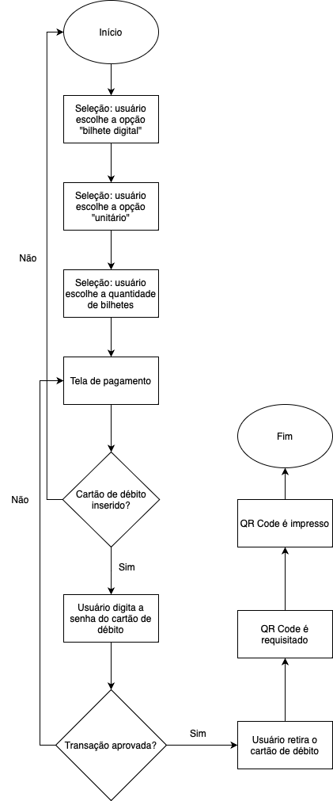

# Autopass Glow-up

# Sobre o Projeto

O projeto Autopass Glow-up consiste em uma releitura das atuais telas dos ATMs da marca com a finalidade de moderniza-los e aprimorar a experiência de seus diversos grupos de usuários.
O termo Glow-up foi escolhido por ser uma gíria atual usada para descrever o florescimento ou "embelezamento" de uma pessoa, ou seja, meu maior desejo é dar uma "cara nova" ao que já existe valendo-me dos recentes conceitos de UI e UX.

<h4 align="center"> 
	🚧  Em desenvolvimento . . .
</h4>

# Índice/Sumário

- [Índice/Sumário](#índicesumário)
- [Entregáveis](#entregáveis)
- [Tecnologias Usadas](#tecnologias-usadas)
- [Fluxo de Usuário](#fluxo-de-usuário)
- [Personas](#personas)
- [Cenários](#cenários)
- [Protótipo Lo-Fi](#protótipo-lo-fi)
- [Protótipo Hi-Fi](#protótipo-hi-fi)
- [Relatório](#relatório)
- [Aplicação Web](#aplicação-web)
- [Vídeo de Apresentação](#vídeo-de-apresentação)
- [Autora](#autora)

# Entregáveis 

- [x] Fluxo de Usuário
- [ ] Personas
- [ ] Cenários
- [x] Protótipo lo-fi
- [x] Protótipo hi-fi
- [ ] Relatório
- [ ] Aplicação Web
- [ ] Vídeo de Apresentação

# Tecnologias Usadas

- [draw.io](https://app.diagrams.net)
- [Obsidian](https://obsidian.md)
- [proto.io](https://proto.io)
- [Tailwind CSS](https://tailwindcss.com)
- [JavaScript](https://developer.mozilla.org/pt-BR/docs/Web/JavaScript)
- [React](https://pt-br.reactjs.org/)

# Fluxo de Usuário

Os seguintes fluxos de usuário foram baseados nos modelos de tela cedidos pela Autopass. Foram respeitados os requisitos funcionais envolvendo vendas de bilhetes e recargas de cartões utilizando dinheiro e cartões de débito.
Uma vez que a recarga com dinheiro segue o mesmo fluxo da compra de bilhetes unitários dessa mesma modalidade, para fins de comodidade visual essa forma de pagamento não consta nos fluxos de recarga por mais que estejam presentes nos ATMs.

##### Bilhetes QR Code

##### Recarga Cartão TOP

##### Recarga Bilhete Único

# Personas

As personas criadas para este projetos buscam ser o mais fiel possível às pessoas que todos os dias circulam pelas ruas de São Paulo, independente de etnia, gênero, classe social e frequência com a qual usa o transporte público. É impossível atender as demandas de todos os usuários, mas o maior esforço foi para incluir os mais diversos grupos nessas personas para que o projeto seja útil ao maior número de usuários possível.
Além disso, todas as imagens utilizadas para os perfis são provenientes da plataforma ["This Person Does Not Exist"](https://this-person-does-not-exist.com/en) para que não sejam utilizadas fotos de pessoas reais.

* <a href="Personas/Persona 1.md">Persona 1
* <a href="Personas/Persona 2.md">Persona 2
* <a href="Personas/Persona 3.md">Persona 3
* <a href="Personas/Persona 4.md">Persona 4
* <a href="Personas/Persona 5.md">Persona 5
* <a href="Personas/Persona 6.md">Persona 6
* <a href="Personas/Persona 7.md">Persona 7

# Cenários
Cada cenário criado corresponde a persona de respectivo número e, assim como estas, foram criados para serem os mais diversos e únicos.

* <a href="Cenários/Cenário 1.md">Cenário 1
* <a href="Cenários/Cenário 2.md">Cenário 2
* <a href="Cenários/Cenário 3.md">Cenário 3
* <a href="Cenários/Cenário 4.md">Cenário 4

# Protótipo lo-fi

A criação do protótipo lo-fi foi feita a mão seguindo as ideias do fluxo de usuário. Apesar de rudimentar, foram acrescentados botões e houve algumas alterações de layout em relação ao projeto já existente. Também foram propostas algumas animações para as telas de carregamento para fixar a atenção do usuário e aumentar seu apreço pelo sistema.

###### Acesse o protótipo <a href="Protótipo lo-fi/Lo-fi.pdf">aqui

# Protótipo hi-fi

A criação do protótipo hi-fi foi feita por meio da plataforma proto.io e levou em conta aspectos do estado atual do projeto, os requisitos funcionais e as características das personas. Também foram levados em consideração fatores como adaptabilidade visual e cores para oferecer a melhor experiência para o usuário.

###### Acesse o protótipo <a href="Protótipo hi-fi/hi-fi.pdf">aqui

# Relatório

<h4 align="center"> 
	🚧  Em desenvolvimento . . .
</h4>

# Aplicação Web

<h4 align="center"> 
	🚧  Em desenvolvimento . . .
</h4>

# Vídeo de Apresentação

<h4 align="center"> 
	🚧  Em desenvolvimento . . .
</h4>

# Autora

[Ana Clara Moraes - 321220389](https://github.com/kimanakim)
